## base
=============
AndroidUSBCamera是基于[saki4510t/UVCCamera](https://github.com/saki4510t/UVCCamera)开发的，USB Camera（UVC设备）项目和视频数据采集的使用高度封装，可以帮助开发者通过一些简单的 API 轻松使用 USB 相机设备。使用AndroidUSBCamera，您可以简单的检测并连接USB Camera，还可以实现拍照、录制mp4、切换分辨率、获取h.264/aac/src.yuv(nv21)码流和设置相机对比度或亮度，支持480P、720P、1080P及更高等。支持覆盖和录制设备的麦克风。

支持安卓5.0,6.0,7.0,8.0,9.0,10.0

##  update gradle

4.1.2

##  build  libuvccamera

因为用NDK14  将14加入PATH

同样  local.properties
添加NDK14

export PATH=/Users/malong/androidNDK/android-ndk-r14b:$PATH

'''
 which ndk-build
/Users/malong/androidNDK/android-ndk-r14b/ndk-build
'''

进入libuvccamera  (libuvccamera/src/main/jni)

只保留arm的库

'''
+++ b/libuvccamera/src/main/jni/Application.mk
@@ -27,6 +27,6 @@
 #NDK_TOOLCHAIN_VERSION := 4.9

 APP_PLATFORM := android-14
-APP_ABI := armeabi armeabi-v7a x86 mips
+APP_ABI := armeabi-v7a arm64-v8a
 #APP_OPTIM := debug
''''

运行
'''
ndk-build
'''

'''
malong@MalongdeMacBook-Pro jni % ndk-build
malong@MalongdeMacBook-Pro jni % ndk-build
[armeabi-v7a] Compile++ arm  : UVCCamera <= _onload.cpp
[armeabi-v7a] Compile++ arm  : UVCCamera <= utilbase.cpp
[armeabi-v7a] Compile++ arm  : UVCCamera <= UVCCamera.cpp
[armeabi-v7a] Compile++ arm  : UVCCamera <= UVCPreview.cpp
[armeabi-v7a] Compile++ arm  : UVCCamera <= UVCButtonCallback.cpp
[armeabi-v7a] Compile++ arm  : UVCCamera <= UVCStatusCallback.cpp
[armeabi-v7a] Compile++ arm  : UVCCamera <= Parameters.cpp
[armeabi-v7a] Compile++ arm  : UVCCamera <= serenegiant_usb_UVCCamera.cpp
[armeabi-v7a] Compile arm    : usb100_static <= core.c
[armeabi-v7a] Compile arm    : usb100_static <= descriptor.c
[armeabi-v7a] Compile arm    : usb100_static <= hotplug.c
[armeabi-v7a] Compile arm    : usb100_static <= io.c
[armeabi-v7a] Compile arm    : usb100_static <= sync.c
...
[arm64-v8a] Compile        : uvc_static <= init.c
[arm64-v8a] Compile        : uvc_static <= stream.c
[arm64-v8a] StaticLibrary  : libuvc_static.a
[arm64-v8a] SharedLibrary  : libuvc.so
[arm64-v8a] StaticLibrary  : libstdc++.a
[arm64-v8a] SharedLibrary  : libUVCCamera.so
[arm64-v8a] Install        : libUVCCamera.so => libs/arm64-v8a/libUVCCamera.so
[arm64-v8a] Install        : libjpeg-turbo1500.so => libs/arm64-v8a/libjpeg-turbo1500.so
[arm64-v8a] Install        : libusb100.so => libs/arm64-v8a/libusb100.so
[arm64-v8a] Install        : libuvc.so => libs/arm64-v8a/libuvc.so

'''

###  Build  --> Make Project

## RUN

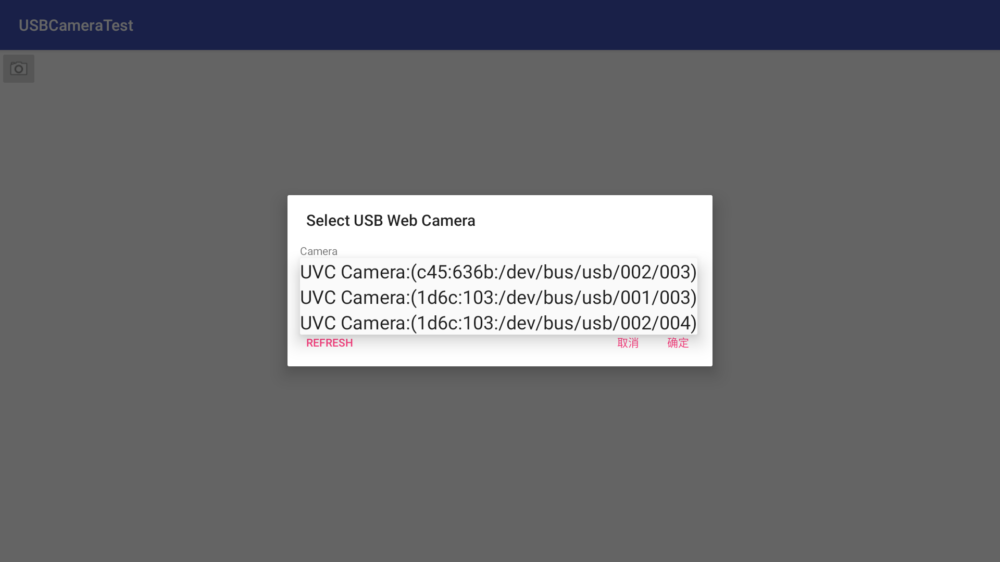

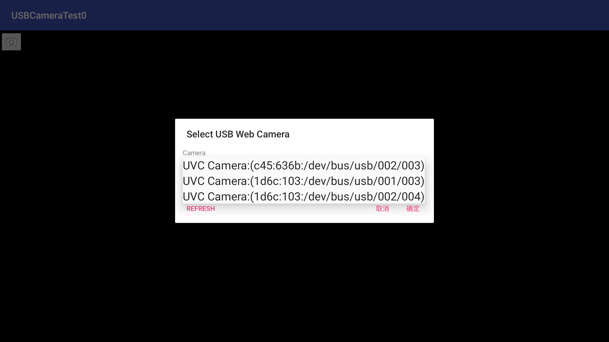

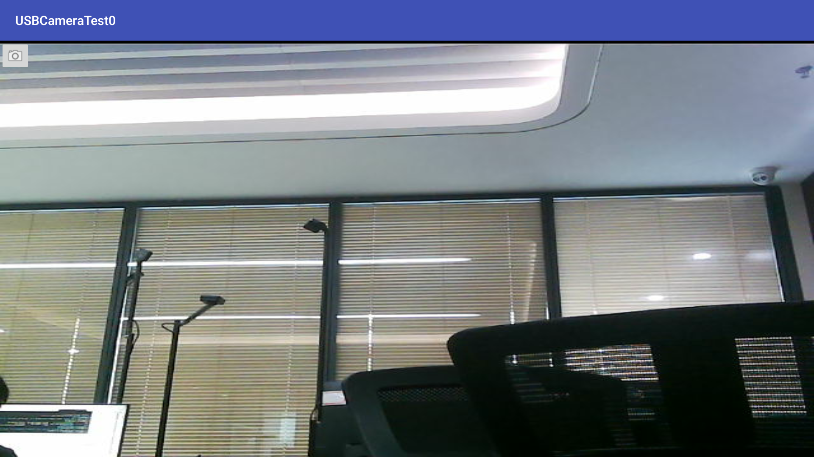

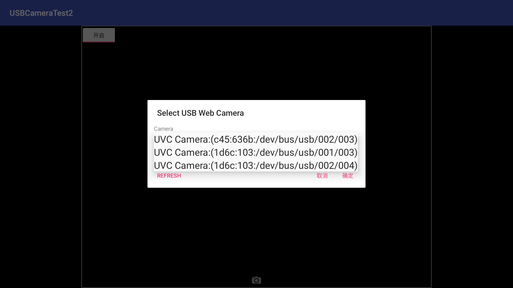

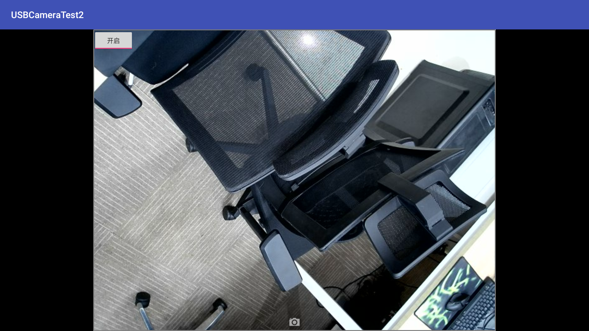

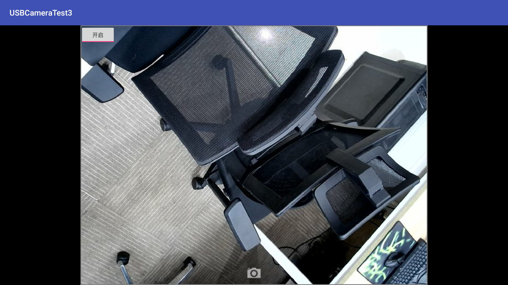

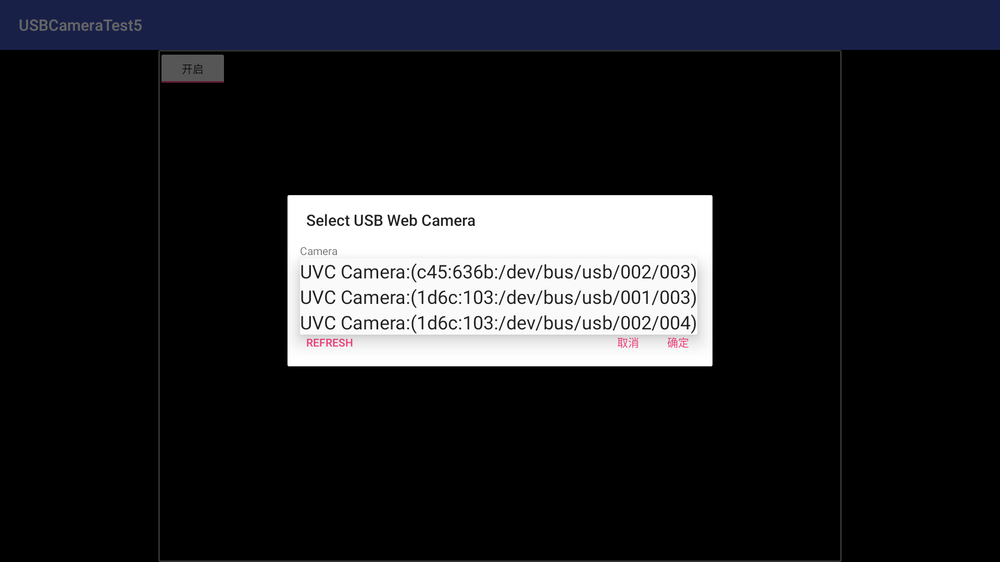

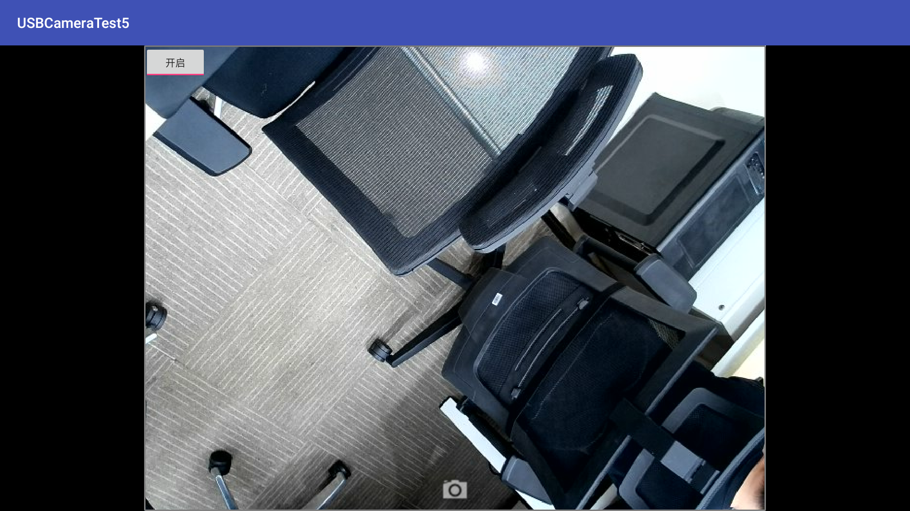

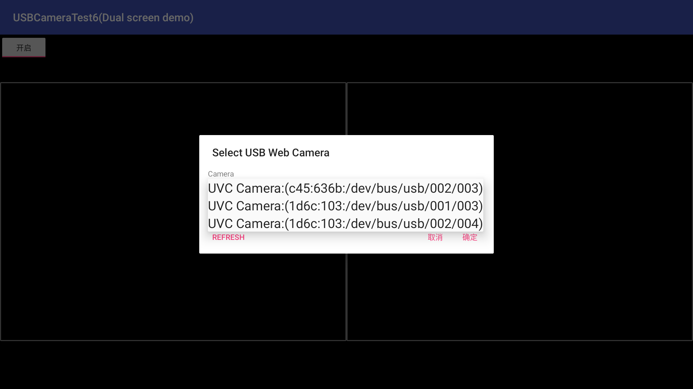

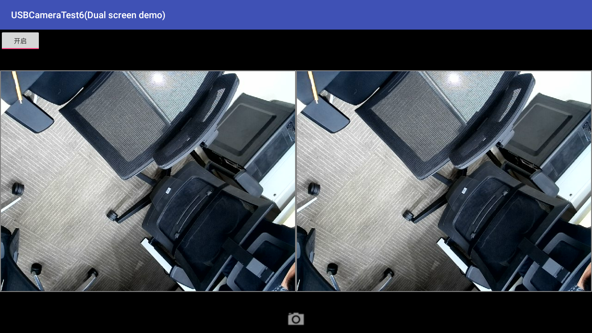

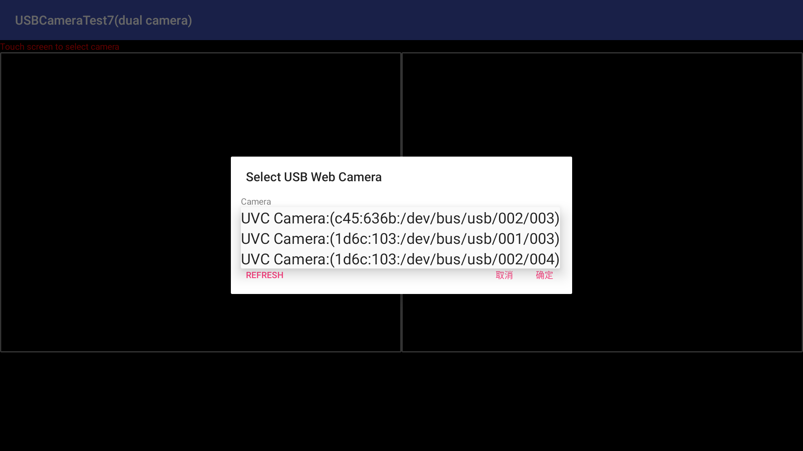

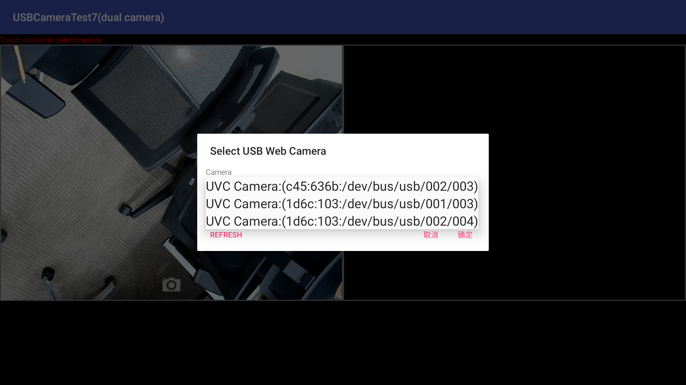

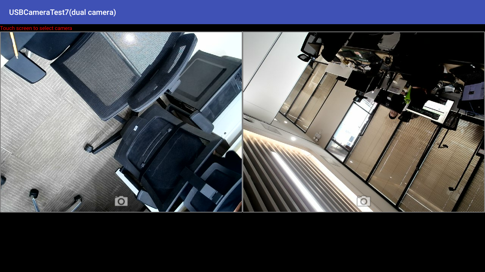